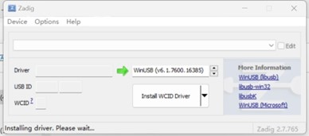
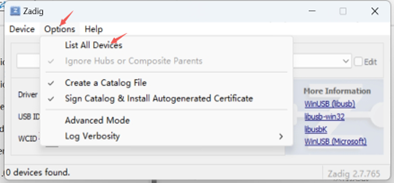
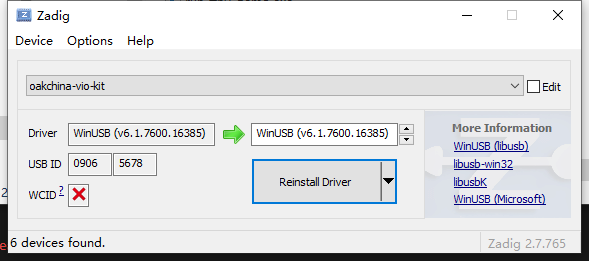
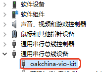
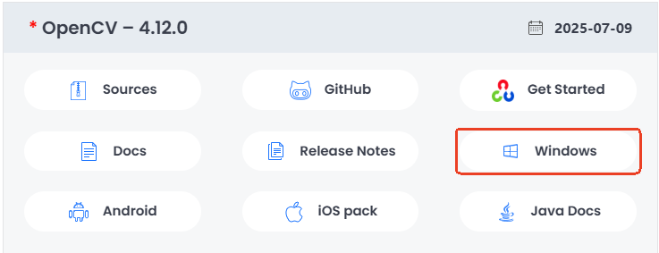
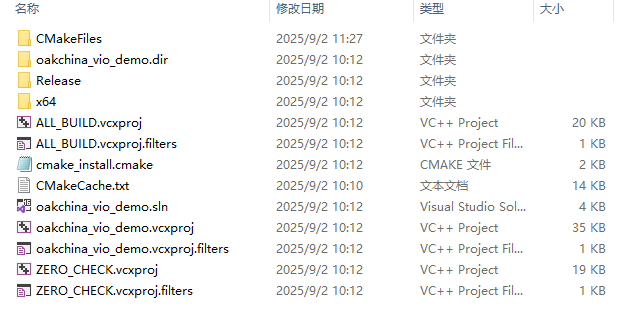
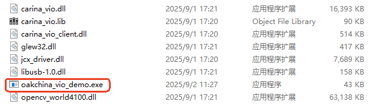

# OAKChina-vio 

视觉惯性里程计（VIO）示例项目

---

## 📋 目录
1. [支持平台](#-支持平台)
2. [前置准备](#-前置准备)
3. [本地运行](#-本地运行)

---

## 🖥️ 支持平台
| 环境         | 版本               | 
|--------------|--------------------|
| **操作系统** | Windows x64   | 

---

## 🔧 前置准备

### 1. 安装驱动

管理员权限运行**driver**目录下的”zading-2.7.exe”程序, 将会出现设备驱动程序安装界面:



将设备连上电脑,在设备驱动程序安装界面点击工具栏”Options”按钮,并选择”List All Devices”:



在下拉选项中选中oakchina-vio-kit设备:



选择对应的设备以后,点击”Install Driver”按钮安装驱动.

驱动安装完成之后，在设备管理器可以找到相应的设备.



### 2. 安裝opencv

1. download and install ([opencv Releases](https://opencv.org/releases/))



2. add environment variable


---

## 💻 本地运行

### 1. 构建项目

获取源代码

```
git clone https://gitee.com/oakchina/oakchina-vio.git
cd oakchina-vio
git checkout windows
```

在项目目录中创建构建目录

```bash
mkdir build
cmake -DCMAKE_GENERATOR_PLATFORM=x64 ..
cmake --build . --config Release
```

编译完成后会在build目录下生成如下文件。



进入Release目录就可以看到编译好的可执行程序。


### 2. 运行示例程序

将编译好的可执行程序复制到动态链接库同一文件夹下。



执行oakchina_vio_demo,并指定配置文件路径。

```bash
.\oakchina_vio_demo ..\custom_config.yaml ..\database.bin
```
